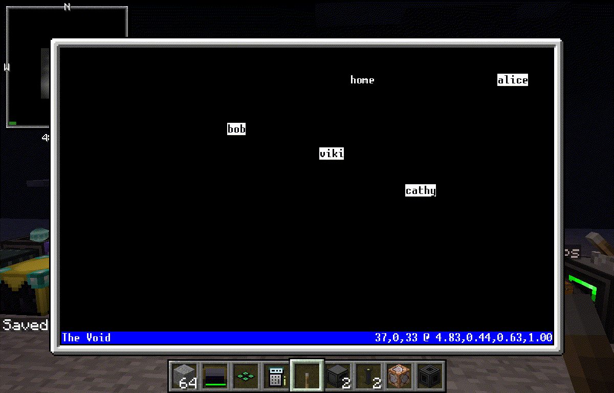

Mr. Rob Oboto
===

Presently just a collection of basic functions and scripts to move, clear, build, craft with an OpenComputer Robot.

The goal is to have a robot that's fully capable of making another robot.

Legal
---

Copyright (C) 2015, 2016 Nolan Eakins <nolan@eakins.net>.

Licensed under the GPL 3.0.

Installation
---

Using an OpenComputer with an Internet card and disk drive, you can use `wget` to fetch this repository like so:

    # wget https://github.com/sneakin/MrRobOboto/raw/master/download.lua download.lua
    # ./download.lua /mnt/$DISK

Now eject and reinsert the disk. All the commands should now be in the shell's path.

To install into the root file system, run while your download disk is inserted:

    # install MrRobOboto

Loot Disk
---

A Mr. Rob Oboto loot disk can be created by copying the contents of this repository to `$MINECRAFT/saves/$WORLD/opencomputers/loot/MrRobOboto` if you're setting this up on your client or `$MINECRAFT_SERVER/opencomputers/loot/MrRobOboto` for a server. Then add a line to `$MINECRAFT/saves/$WORLD/opencomputers/loot/loot.properties` for a client that reads:

    MrRobOboto=Mr. Rob Oboto:1:dyeBlue

Now you can obtain a read only Mr. Rob Oboto disk in dungeons or in creative mode. For a server, adjust the path as for the disk's directory.

Usage
---

Mr. Rob Oboto comes with many many commands. Look inside `./bin/`. Each supports a `-help` argument that prints out a description and list of arguments. Most commands are robot related while some manage a coordinator and others are for fun.

Most robot commands support movement checkpoints and rollbacks. For example: if the robot tries to fill an area that was not cleared, he will stop and move back to where he booted waiting for instruction. The checkpoints can be managed with the `path` and `rollback` commands.

A few commands also provide background services. These have `rc` scripts to automatically start them upon boot. You have to install everything to your root disk before you can use `rc service enable`. Look in `./etc/rc.d/` to see what services are available.

